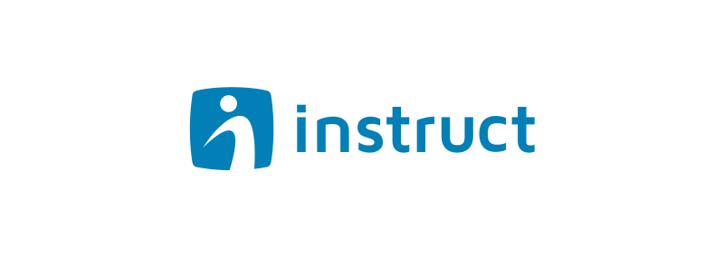

# Lista de Contatos
[](https://nodejs.org/docs/latest-v9.x/api/)
[](https://app.netlify.com/sites/instructcontacts/deploys)

> Organizador de contatos.

## Build Setup

``` bash
# Instalar dependências
$ yarn install

# Inciar servidor de desenvolvimento com hot reload em localhost:3000
$ yarn run dev

# Build para produção e iniciar servidor
$ yarn run build
$ yarn start
```

Veja a documentação completa do framework: [Nuxt.js docs](https://nuxtjs.org).
